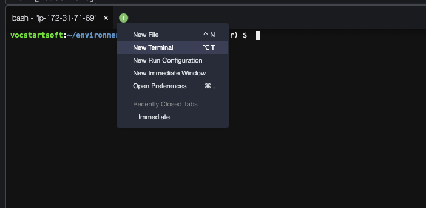
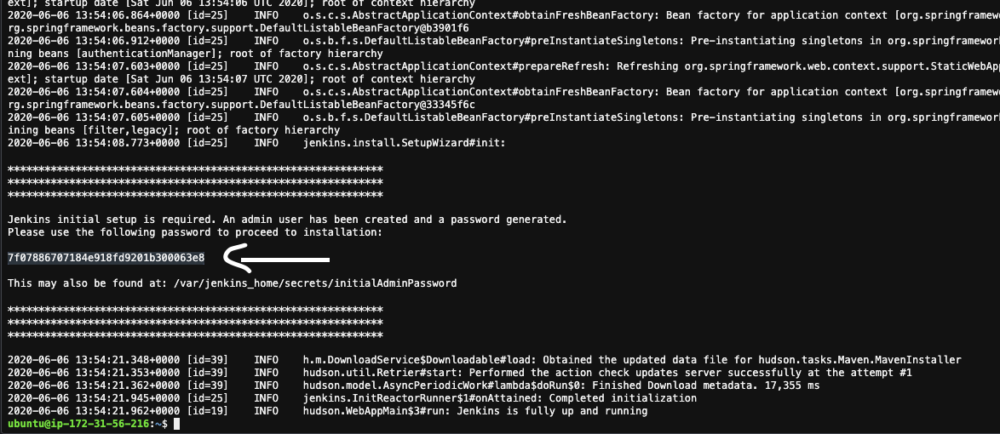
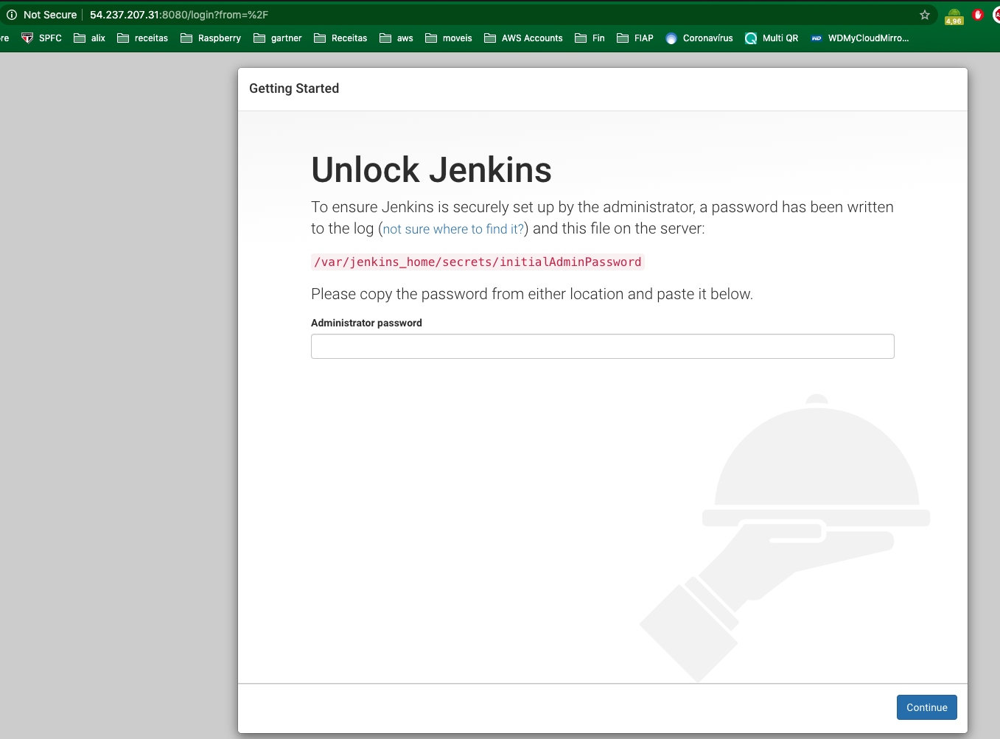
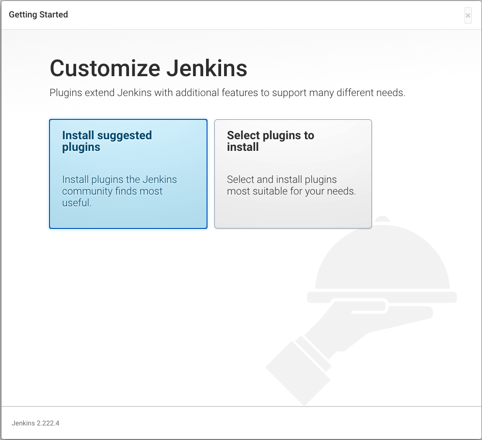
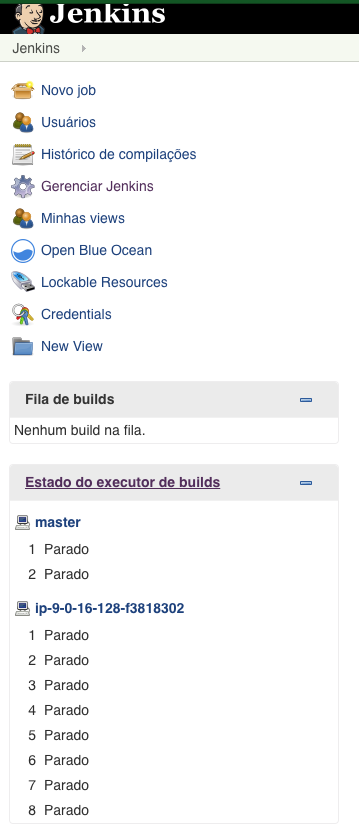
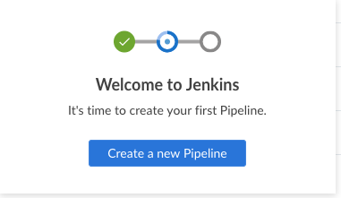
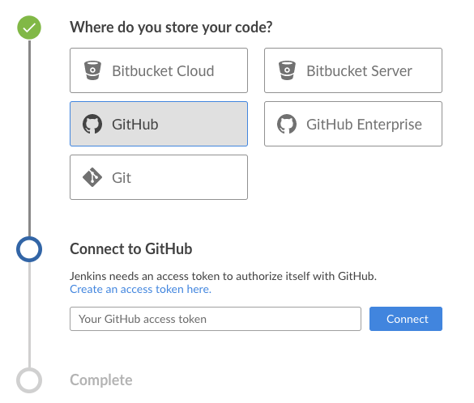
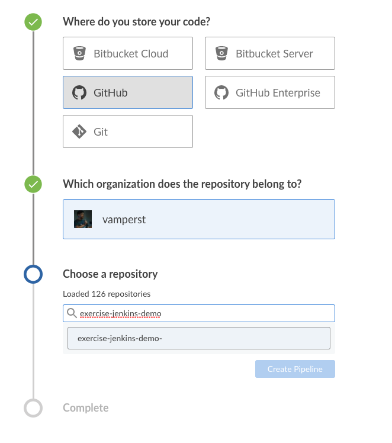

## CICD 3.1 - Jenkins

1. Execute o comando `cd ~/environment` para voltar ao diretório principal
2. Para clonar o repozitório do exercico utilize o comando `git clone https://github.com/vamperst/exercise-jenkins.git`
3. Entre na pasta com o comando `cd exercise-jenkins`
4. Primeiramente vamos subir a maquina que fará o papel de master. Para tal utilize o comando `cfn-create-or-update --region us-east-1 --stack-name jenkins-master --wait --template-body file://ec2-master.yaml --capabilities CAPABILITY_NAMED_IAM`. Aguarde a instancia ser criada
5. Agora coloque no S3 os scripts de instalação de mauqina com os comandos:
    ```
    aws s3 cp script-jenkins-agent.sh s3://base-config-<SEU RM>/cfn/exercise-cicd/
    aws s3 cp script-jenkins-master.sh s3://base-config-<SEU RM>/cfn/exercise-cicd/
    ```
6. Após a criação da intancia você precisa do ip publico dela para fazer o acesso SSH. Podemos pegar o ip dos outputs do cloudformaiton com o comando `aws cloudformation describe-stacks --stack-name jenkins-master --query "Stacks[0].Outputs[?OutputKey=='PublicIP'].OutputValue" --output text`. Copie o ip.
7. Abra uma nova aba do terminal do Cloud9 clicando no sinal de `+` ao lado da aba que esta atualmente e clicando em `new terminal`
   
   
8. Utilize o seuinte comando da acessar a maquina do jenkins: `ssh -i ~/.ssh/fiap-lab.pem ubuntu@<IP DO MASTER COPIADO>` e aceite conectar digitando `yes`
9.  Dentro da maquina baixe o arquivo de instalação do jenkins master com os comandos:
    ```
    sudo apt update -y
    sudo apt install awscli -y
    aws s3 cp s3://base-config-<SEU RM>/cfn/exercise-cicd/script-jenkins-master.sh .
    ```
10. Para executar o script de instalação do jenkins utilize o comando `sudo bash script-jenkins-master.sh `. O master vai ser instalado utilizendo docker
11. Ao final copie a senha admin provisória que aparece na tela.
    
12. Em uma nova aba do navegador cole o ip do master com a porta :8080 `ip-master:8080`
13. Cole a senha que copiou e clique em continue.
    
14. Clique em `Install suggested plugins`
    
15. Aguarde o fim da instalação
    
16. Nesse passo você irá configurar o usuario e senha default. Coloque o usuario como 'admin' e a senha como '12345678'. Isso é importante para o restante do exercicio.
    
17. Clique em `save and continue` e na tela seguinte em `save and finish`
18. Já no jenkins no menu lateral clique em `gerenciar jenkins`
    
19. Vamos precisar de alguns plugins, por isso vamos instalar os mesmos. Clique em `gerenciar plugins`
20. Clique na aba `Disponíveis` no superior da tela. Após isso, pesquise e selecione os sequintes plugins:
    1.  AnsiColor
    2.  Blue Ocean
    3.  Self-Organizing Swarm 
    4.  Throttle Concurrent Builds


21. Somente depois de escolher todos clique em `Baixar aagora, instalar e reiniciar`. Clique no checkbox para reiniciar o server jenkins
22. O processo pode demorar alguns minutos até ser completo.
23. Após um tempo o jenkins volta a funcionar, pode ser que tenha que digitar usuário e senha. Caso passe 5 minutos e não tenha tenha carregado a pagina de usuario e senha. Atualize a pagina manualmente.
24. Agora que o Jenkins esta restabelecido vamos colocar um limite de execuções por agente. Para tal clique em `Gerenciar jenkins`, clique em `configurar sistema`, vá até `Throttle Concurrent Builds`
    
25. Clique em `add category`, de o nome a categoria de `throttleDocker`. Clique em `Add Maximum Per Labeled Node` e coloque o valor `docker` em Throttled Node Label. Por fim em 'Maximum Concurrent Builds Per Node Labeled As Above' coloque o numero 1:
    
26. Clique em `salvar`
27. Volte a aba do cloud9 para utilizar a linha de comando
28. Volte primeira aba do terminal.
29. No IDE do Cloud9 abra o arquivo `ec2-agent.yaml` que está no caminho `fiap-lab/exercise-jenkins` e altere o nome do bucket para que fique com o que criou. Salve.
    
30. Agora vamos criar a maquina que será agent do Jenkins. Para tal utilize o comando `cfn-create-or-update --region us-east-1 --stack-name jenkins-agent-1 --wait --template-body file://ec2-agent.yaml  --capabilities CAPABILITY_NAMED_IAM --parameters ParameterKey=IpMaster,ParameterValue=<IP PUBLICO JENKINS MASTER>`,tome o cuidado e alterar o ip publico do seu jenkins master no final do comnado.
31. Após o termino do comando espere alguns minutos e recarregue a pagina principal do jenkins. Note que foram adicionados agentes de execução.
    

32.  Vamos Criar o pipeline do nosso CI. Clique em `Open blue ocean`
33.  Clique em `create new pipeline`
    
    

34. Escolha o `github`
35. Clique em `Create Acess token here` para ser redirecionado para o github e criar uma chave. Cole a chave que acabou de criar no campo `your github acess`
    
    
36. Escolha o repositório `exercise-jenkins-demo` da sua conta. Caso não tenha feito o fork entre no git <https://github.com/vamperst/exercise-jenkins-demo> e faça clicando em fork no lado superior direito.
    
37. Clique em `Create pipeline`
38. Pare todos os pipelines criados alem do `master` clicando no simbolo de parar no final de cada linha.
39. Clique em master
40. Nessa tela você conseguirá acompanhar as fases do pipeline rodando até terminar.
    

41. Volte a linha de comando do Cloud9 e digite os seguintes comandos para deletar as stacks do Jenkins:
    ```
    aws cloudformation delete-stack --stack-name jenkins-agent-1
    aws cloudformation delete-stack --stack-name jenkins-master
    ```