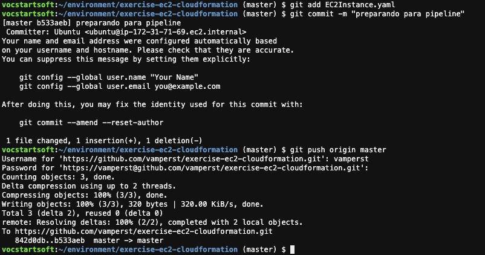
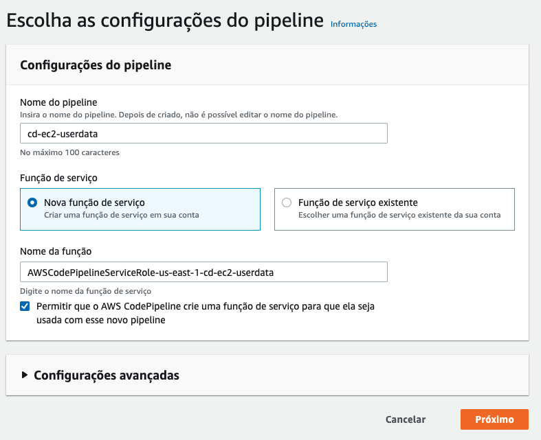
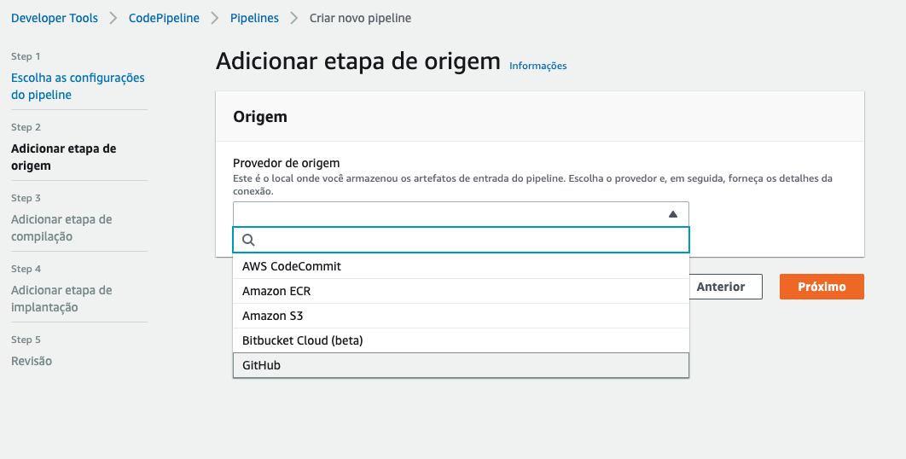
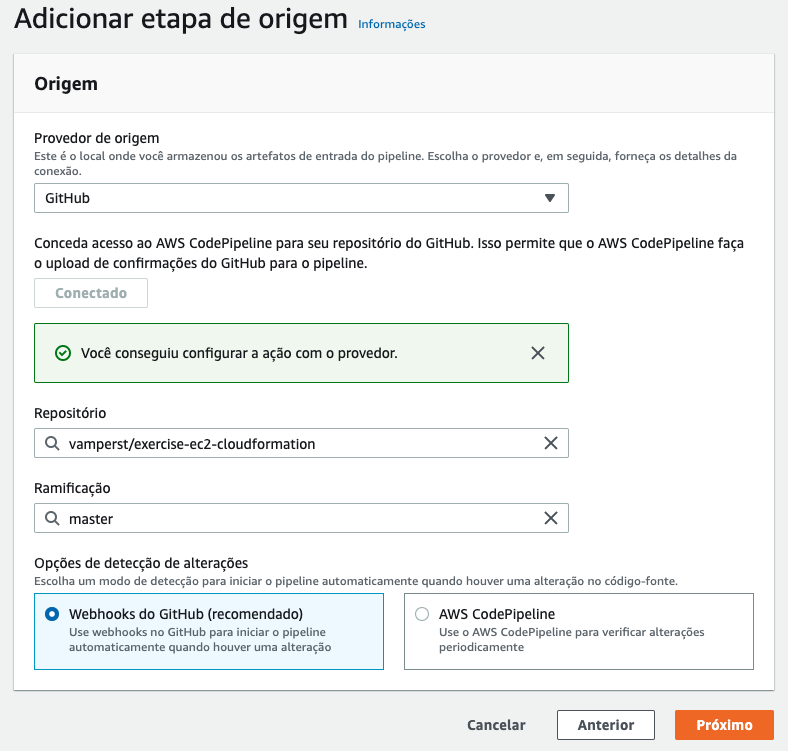
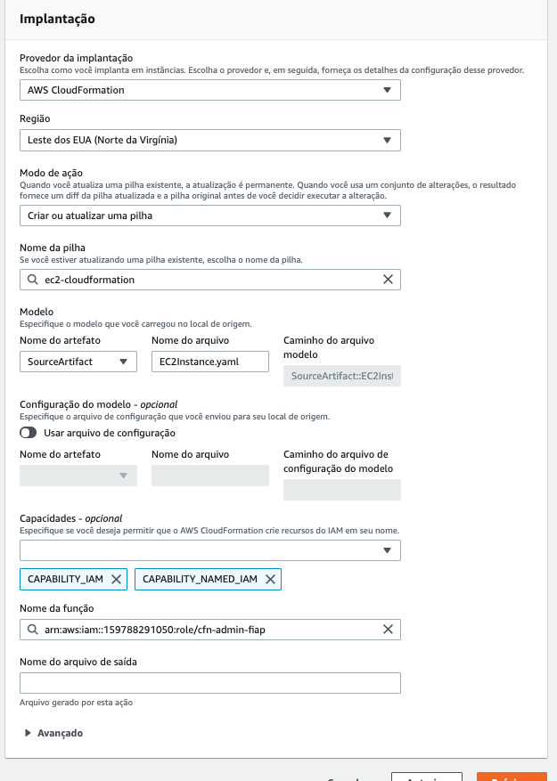
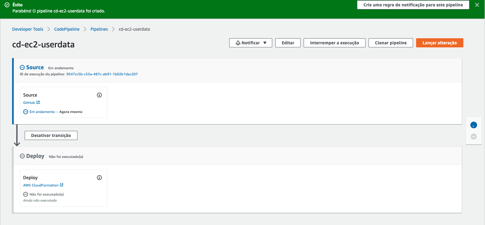
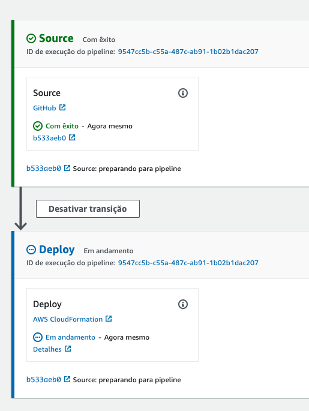
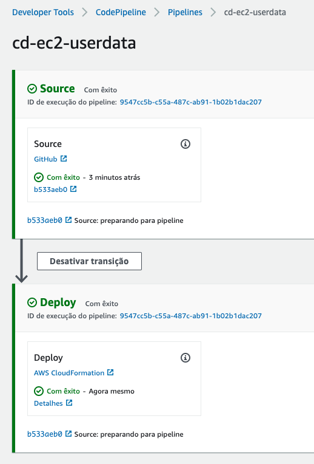

## CICD 3.1 - Cloudformation - EC2-UserData

1. Inicialmente vamos criar as ROLES que iremos utilizar em todos os exercicios com CICD e cloudformation. Para isso entre na pasta com os templates utilizando o comando `cd ~/environment/cicd-tutorials/base-templates/`
2. Execute o comando `cfn-create-or-update --region us-east-1 --stack-name roles-cicd --wait --template-body file://basic-iam-roles.yaml  --capabilities CAPABILITY_NAMED_IAM` para criar as roles.
3. Execute o comando `cd ~/environment` para voltar ao diretório principal.
4. Em outra aba do navegador faça o fork para sua conta do github do repositório <https://github.com/vamperst/exercise-ec2-cloudformation>
5. De volta ao terminal do cloud9 apague o projeto do repositório que acabou de fazer fork e baixe o da sua conta com os comandos abaixo. Não esqueça de adicionar seu login do github ao segundo comando:
   ```
   rm -rf ~/environment/exercise-ec2-cloudformation
   git clone https://github.com/<SEU LOGIN NO GITHUB>/exercise-ec2-cloudformation.git
   ```
6. Entre na pasta ` cd exercise-ec2-cloudformation`
7. No IDE do Cloud9 abra o arquivo `EC2Instance.yaml` que esta no caminho `fiap-lab/exercise-ec2-cloudformation`
8. Na linha 72 altere o nome do bucket para o que você criou e salve.
   
   
9. Devolta a linha de comando execute os comandos abaixo para fazer o commit do código para o seu github e estar tudo preparado para que o pipeline não execute com erro.
    ``` shell
    git add EC2Instance.yaml
    git commit -m "preparando para pipeline"
    git push origin master
    ```


10. Em outra aba do navegador entre no serviço `CodePipeline` do console AWS.
11. Clique em `Criar pipeline` no canto supeiror direito
   

11. De o nome de `cd-ec2-userdata` ao pipeline, clique no checkbox e clique em 'próximo'
   

11. Selecione Github como origem e clique em `Conectar ao GitHub`. Faça o login como pedido.
   
12. Escolha o reposítorio `exercise-ec2-cloudformation` que esta na sua conta no ramo `master` e clique em `Próximo`
    

13. Clique em `Ignorar etapa compilação` e `ignorar`
14. Em Implatação escolha `AWS Cloudformation` e coloque os seguintes parametros:
    1.  Nome da pilha = ec2-cloudformation
    2.  Nome do arquivo = EC2Instance.yaml
    3.  Capacidades = CAPABILITY_IAM e CAPABILITY_NAMED_IAM
    4.  Nome da função = cfn-admin-fiap

15. Clique em `Próximo`
16. Clique em `Criar Pipeline`
17. Assim que voltar a tela principal do pipeline ele começará a executar
    

18. Quando chegar na fase de deploy clique em `Detalhes` para abrir a tela do Cloudformation
    

19. Ao final você terá o cloudformation implantado e a instância criada.
    

20. De volta ao terminal do cloud9 utilize o comando `aws cloudformation delete-stack --stack-name ec2-cloudformation` para deletar a stack criada.
