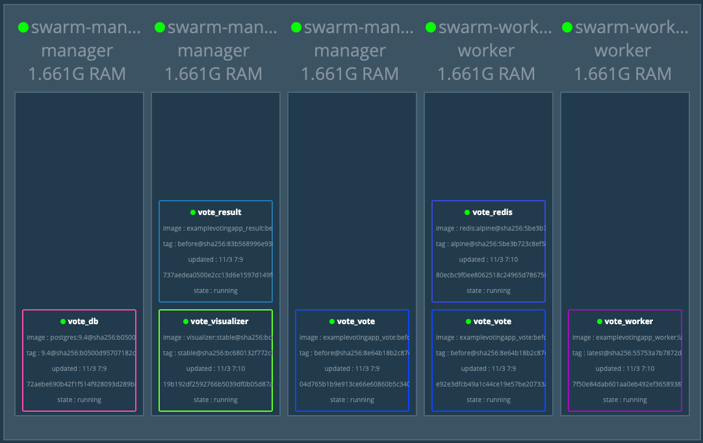
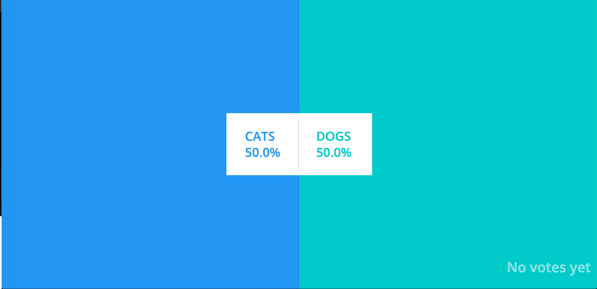
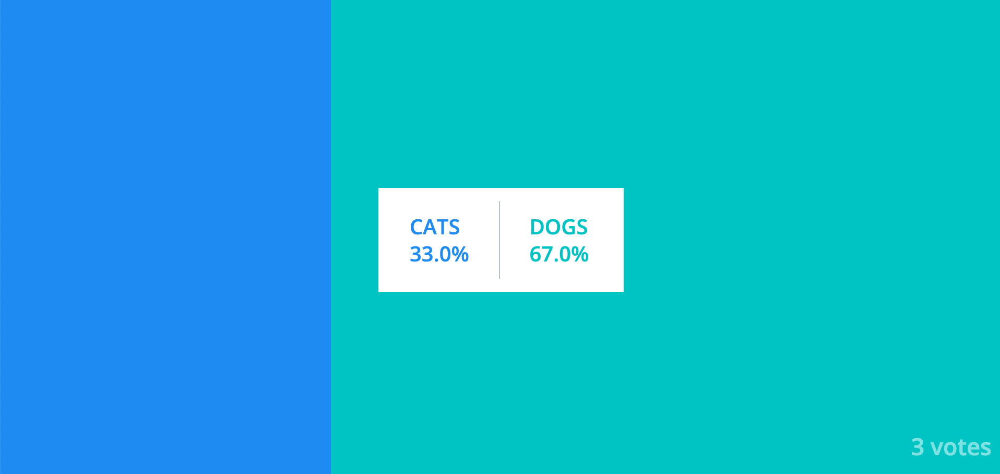
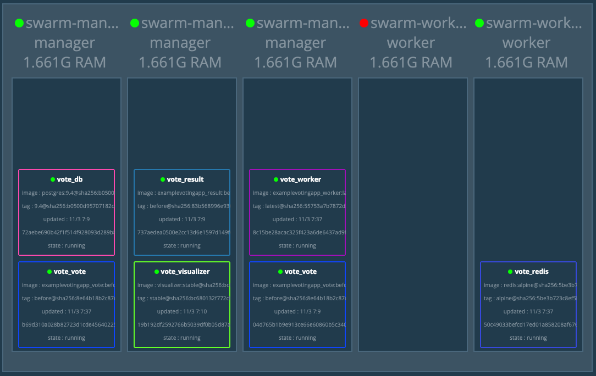
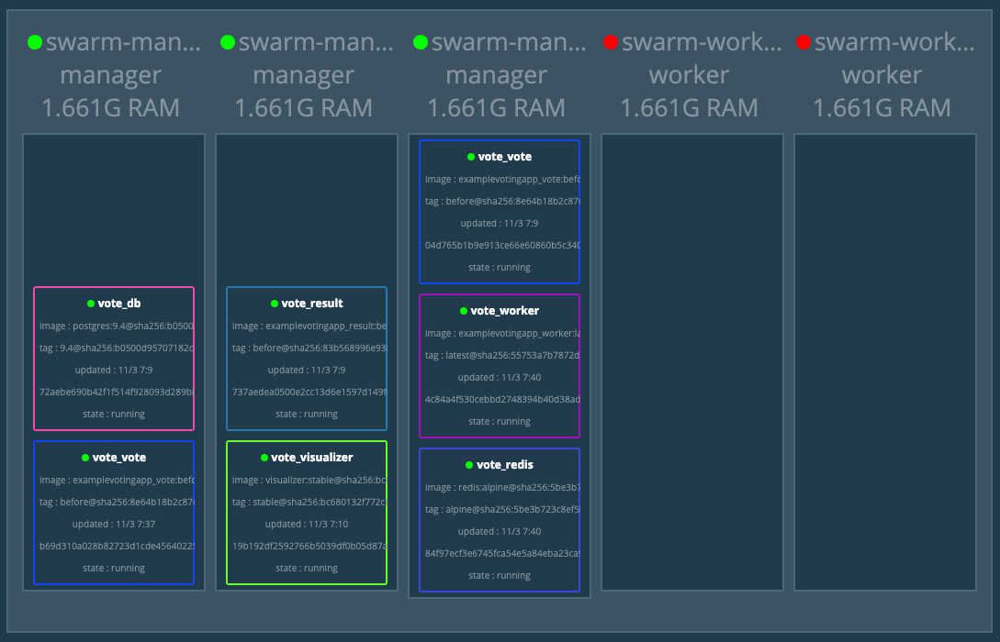
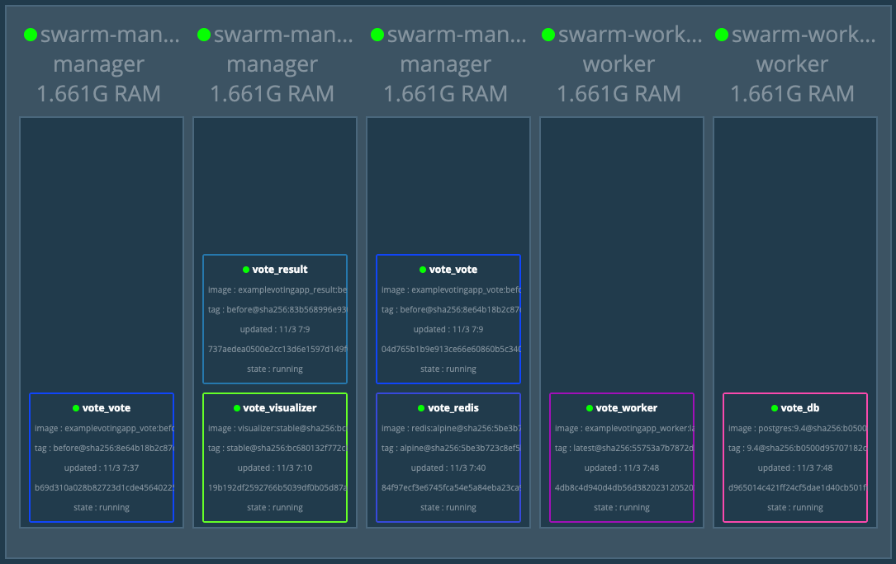

1. Entre em um dos managers via ssh
2. Faça o clone do resositório vote-docker-exemple com o comando `git clone https://github.com/vamperst/vote-docker-exemple.git`
3. Para subir a stack execute o comando `docker stack deploy --compose-file docker-compose.yml vote`
4. Note no visualizer que o container no visualizer ficou em um nó manager como esta na configuração.
    
5. Teste o Serviço de votação. Primeiro abra uma aba com o ip externo de qualquer maquina do cluster seguido da porta :5001 para visualizar o contador de votos. Para a pagina de votação use o ip de qualquer maquina do cluster com a porta :5000.
   

   
6. Você deve ter notado que o sistema guarda apenas um voto, e cado mude seu voto, isso reflete na porcentagem da contagem (100% para a sua ultima opção), mas não reflete na quantidade. Para descobrir o que esta acontecendo vamos ver o log do banco que serve o aplicativo resultapp. Para tal execute o comando `docker service logs -f vote_db`. Note que cada vez que vota na mesma opção ocorre um erro.
   
7. O erro acima ocorre porque a chave do banco utilizada na votação é o cookie do seu navegador. Logo para conseguir votar mais de uma vez é necessário abrir abas privativas no seu navegador, acessar a página de votação, executar o voto e fechar. Para abrir abas privativas utilize o atalho CTRL + Shift + N. Note que agora quando vota a porcentagem e a quantidade se alteram.
   
8. Vamos simular uma falha. Desligue a maquina 'swarm-worker-1' e acompanhe o visualizer.
    
9. Desligue a 'swarm-worker-2' também
    
10. Ligue novamente as maquinas. Note que os serviços não são recolocados nas instancias que voltaram. Isso porque o sistema é contra falhas. Os nós ficaram disponiveis para novos containers. Para testar isso, entre na maquina onde esta o db, é possivel descobrir pelo visuzlizer,copie o nome do container db que aparecer com o comando `docker container ls` e mate o container do banco de dados com o comando `docker container rm -f <NOME DO CONTAINER>`. Observe no visualizer a movimentação dos containers.
    
11. É provavel que o container do serviço de worker também mude de local devido a uma falha na conexão com o banco, já que o app depende de um streaming. Você pode verificar esse erro vendo o log do serviço do worker.
12. Delete a stack com o comando `docker stack rm vote`
13. Este exercicio consumiu bastante espaço nas maquinas do cluster. Entre em cada uma delas e rode o comando `docker system prune -a` para que todas fiquem sem containers e imagens que já não são mais uteis.
    
