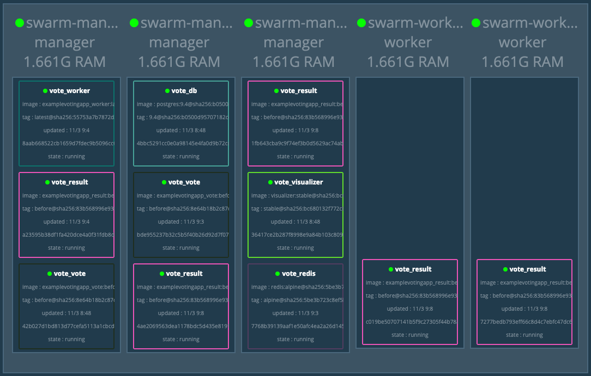
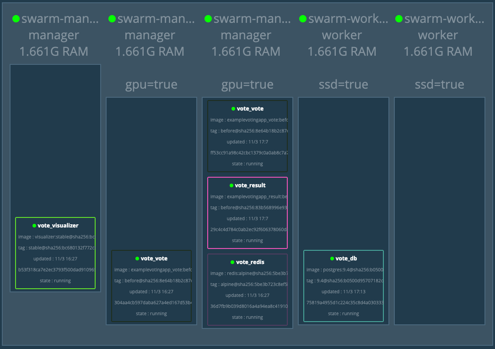

1. Acesse uma instancia manager via ssh. Vamos utilizar o mesmo projeto do ultimo exercicio. Caso não tenha, execute o comando `git clone https://github.com/vamperst/vote-docker-exemple.git`
2. Entre na pasta do projeto com o comando `cd vote-docker-exemple`
3. Suba a stack com o comando `docker stack deploy --compose-file docker-compose.yaml vote`
4. Verifique se todos os serviços já estão em execução com o comando `docker service ls`
   
5. Abra uma aba no seu navegador para monitorar o visualizer
6. Vamos simular uma alta demanda do result-app tendo que escalar. Desligue os 2 workers.
7. Utilize o comando `docker service scale vote_result=20`
8. Ligue novamente os 2 workers
9. Vamos aumentar ainda mais o numero de containers do serviço com o comando `docker service scale vote_result=40`, note que os 2 workers recebem todos os novos containers.
10. Agora que pasosu o pico de acesso, rode `docker service scale vote_result=5`. O cluster volta a ficar equilibrado em numero de containers por nó.
    
11. Execute o comando `git fetch && git checkout parte1` para mudar de branch no projeto.
12. Note que o arquivo compose tem algumas mudanças, tem mais configurações.
13. Faça um deploy com o novo compose utilizando o comando `docker stack deploy --compose-file docker-compose.yaml vote`, os serviços vão ser todos atualizados porque já existem no cluster.
    
14. Agora vamos adicionar algumas labels aos hosts. Label de ssd (perfeito para bancos de dados), e GPU.
15. Execute os comandos `docker node update --label-add ssd=true swarm-worker-1` e  `docker node update --label-add ssd=true swarm-worker-2`
    
16. Execute os comandos `docker node update --label-add gpu=true swarm-manager-2`e `docker node update --label-add gpu=true swarm-manager-3`
17. Para ter certeza que os labels funcionaram execute o comando `docker node ls -q | xargs docker node inspect   -f '[{{ .Description.
Hostname }}]: {{ .Spec.Labels }}'` 
    
18. Atualize seu compose para a versão onde as tags são utilizadas. Para tal execute o comando `git fetch && git checkout parte2`
19. Note que agora os serviços "vote" e "db" dependem de hosts com tags.
20. Pare os 2 workers
21. Execute o novo compose com o comando `docker stack deploy --compose-file docker-compose.yaml vote`
22. Utilizando o comando `docker service ls` vai notar que os serviços db e worker estão em zero. O db por não ter maquinas para subir, e o worker por não funcionar sem o db.
    
23. Ligue novamete os workers
24. Note que assim que o primeiro worker ligou um container db foi colocado nele
        
25. Caso seu serviço "Worker" não retorne a normalidade é porque atingiu o maximo de tentativas configurada. Force o serviço com o comando `docker service scale vote_worker=1`
    
26. Desligue somente o 'swarm-manager-3'
27. Execute o comando `docker service scale vote_vote=20`, note que o swarm não coloca o container em outras maquinas mesmo tendo espaço e processamento livre.
28. Ligue o swarm-manager-3'
29. Execute o comando `docker service scale vote_vote=2`
30. remova a stack