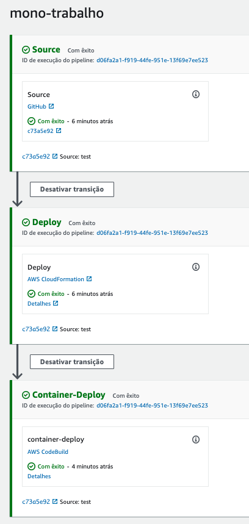
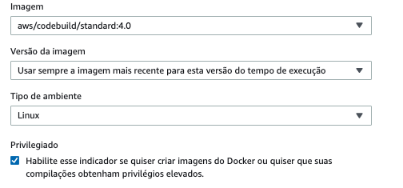

## Trabalho Final

1. Faça o fork do código disponivel nos repositórios para sua conta no github: 
   1. https://github.com/vamperst/ecs-container-mono-project
   2. https://github.com/vamperst/ecs-container-microservices-project
2. Baixe os repositórios no cloud9
3. Em cada repositório adicione um "buildspec.yml" onde você seguira o modelo abaixo adicionando o código nescessário para a fase BUILD:
   ```
    version: 0.2
    phases:
    install: 
        runtime-versions:
        docker: 18
        commands: 
        - apt-get update -y
        - apt-get install -y jq
        - curl -L https://npmjs.org/install.sh | sh
        - npm -v
    build:
        commands:
        - <ADICIONE SEU CÓDIGO AQUI>
        - echo "teste" >> elb.txt
    post_build:
        commands:
        - echo "DONE!!!!"
        
    artifacts:
    files: 
        - elb.txt
   ```

4. Construa um code pipeline para cada repositório, com as fases:
   1. Github
   2. Cloudformation
   3. CodeBuild
   
5. Utilize o mesmo codebuild dos exercicios (build_cicd).
6. A entrega consiste em um zip contendo:
   1. Os 2 buildspec.yml criados
   2. Prints dos 2 code pipelines executados com sucesso
   3. prints dos logs executados com sucesso
7. Submeta o zip no portal FIAP

### dicas
1. Não se esqueça de adiiconar a variável `stackName` na configuração do code pipeline que chama o codebuild com o nome que deu para a stack na configuração do estagio cloudformation. Seguindo o exemplo dos exercicios da aula de CICD.
2. Verifique se o codebuild esta como o modo privilégio da imagem no editor de ambiente selecionada. Verifique no codebuild `build_cicd` eeditar -> ambiente -> substituir imagem:
   
3. se atente que o yml do cloudformation não esta na raiz da pasta, esta em infrastructure/ecs.yml